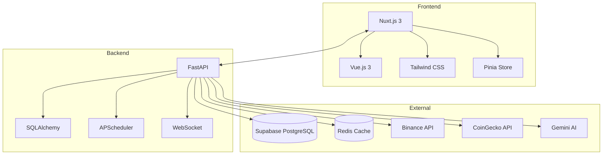
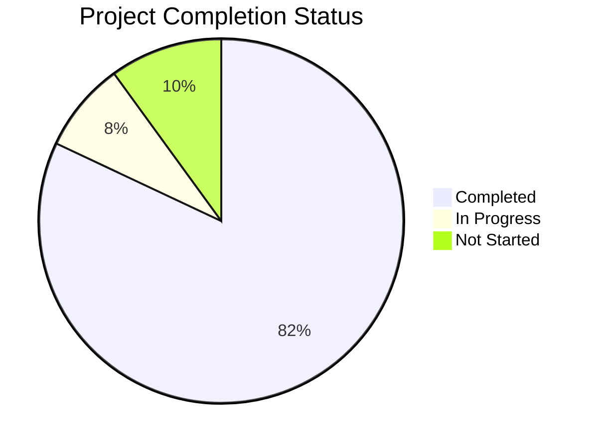

# 📊 Báo Cáo Tình Trạng Dự Án AI Crypto Hub Pro

> **Ngày:** 24/12/2024  
> **Phiên bản:** 2.1.0  
> **Dự án:** aicryptohub-pro (Microservices SaaS Platform)

---

## 📋 Tổng Quan

**AI Crypto Hub Pro** là nền tảng SaaS phân tích giao dịch tiền điện tử được xây dựng theo kiến trúc microservices, thay thế hoàn toàn WordPress plugin cũ bằng công nghệ hiện đại.



---

## ✅ Những Gì Đã Hoàn Thành

### 1. Backend (Python FastAPI) - 90% Complete

| Component | Status | Mô tả |
|-----------|--------|-------|
| **Core API** | ✅ Done | FastAPI với endpoints đầy đủ cho market, portfolio, auth |
| **Data Fetcher** | ✅ Done | Multi-source fetcher: CoinGecko, Binance, CoinCap, OKX, Bybit, KuCoin, Gate.io |
| **Database Service** | ✅ Done | SQLAlchemy với Supabase PostgreSQL |
| **AI Analyzer** | ✅ Done | Technical Analysis với RSI, MACD, Bollinger, Stochastic |
| **On-Chain Collector** | ✅ Done | Whale transactions, DAU, Top holders tracking (Etherscan V2) |
| **Real-time Streamer** | ✅ Done | Binance WebSocket → Redis Pub/Sub |
| **Background Scheduler** | ✅ Done | APScheduler cho fetcher và AI workers |
| **Admin Endpoints** | ✅ Done | User management, AI workers control, data triggers |
| **WebSocket Logging** | ✅ Done | Real-time logs cho admin console |

#### Backend Endpoints đã implement:

```
📂 app/api/endpoints/
├── admin.py          # Admin dashboard stats, settings
├── admin_ai_workers.py   # AI worker control
├── admin_data.py     # Data management endpoints
├── admin_fetcher.py  # Manual data fetch triggers
├── admin_users.py    # User CRUD operations
├── admin_ws.py       # WebSocket for real-time logs
├── auth.py           # JWT authentication
├── market.py         # Market data endpoints
├── onchain.py        # On-chain signals
├── portfolio.py      # Portfolio management
├── realtime.py       # Real-time price streaming
├── sentiment.py      # AI sentiment data
└── triggers.py       # Manual job triggers
```

#### Backend Services:

```
📂 app/services/
├── analyzer.py           # Technical analysis engine
├── cache.py              # Redis caching
├── data_fetcher.py       # Multi-source data fetching
├── database.py           # PostgreSQL operations
├── deepseek.py           # DeepSeek AI integration
├── gemini.py             # Gemini AI integration
├── onchain.py            # On-chain data service
├── onchain_collector.py  # Whale/DAU/Holders collector
├── price_aggregator.py   # Price aggregation
├── scheduler.py          # Background job scheduler
├── socketio_server.py    # Socket.IO server
└── streamer.py           # Binance WebSocket streamer
```

---

### 2. Frontend (Nuxt.js 3) - 85% Complete

| Component | Status | Mô tả |
|-----------|--------|-------|
| **Desktop Dashboard** | ✅ Done | Market overview, charts, stats |
| **Desktop Market** | ✅ Done | Full coin listing với filters |
| **Desktop Analysis** | ✅ Done | Technical analysis view |
| **Desktop Portfolio** | ✅ Done | Portfolio tracking |
| **Desktop On-Chain** | ✅ Done | On-chain signals display |
| **Mobile Dashboard** | ✅ Done | Responsive mobile UI (Real Data Integrated: Mood, Heatmap, Gems, Whale) |
| **Mobile Market** | ✅ Done | Mobile market view |
| **Mobile Analysis** | ✅ Done | Mobile analysis view |
| **Mobile Portfolio** | ✅ Done | Mobile portfolio |
| **Mobile Search** | ✅ Done | Mobile search functionality |
| **Price Flash Effects** | ✅ Done | Real-time price change animations |
| **Authentication** | ✅ Done | Login/Register pages |
| **Real Data Integration** | ✅ Done | Mobile Dashboard fully connected to Backend APIs (Categories, OnChain, Gems) |

#### Frontend Components Structure:

```
📂 frontend/
├── components/
│   ├── desktop/
│   │   ├── DesktopDashboard.vue    # 22KB
│   │   ├── DesktopMarket.vue       # 10KB
│   │   ├── DesktopAnalysis.vue     # 6KB
│   │   ├── DesktopPortfolio.vue    # 8KB
│   │   ├── DesktopOnChain.vue      # 8KB
│   │   └── DesktopHeader.vue       # 9KB
│   ├── mobile/
│   │   ├── MobileDashboard.vue     # 35KB ⭐
│   │   ├── MobileMarket.vue        # 31KB ⭐
│   │   ├── MobileAnalysis.vue      # 40KB ⭐
│   │   ├── MobilePortfolio.vue     # 10KB
│   │   ├── MobileSearch.vue        # 11KB
│   │   ├── MobileAIChat.vue        # 8KB
│   │   ├── MobileAlerts.vue        # 5KB
│   │   ├── MobileOnChain.vue       # 10KB
│   │   └── MobileLayout.vue        # 5KB
│   └── shared/
│       ├── AsiGauge.vue
│       ├── CoinCard.vue
│       └── SignalBadge.vue
├── composables/
│   ├── useApi.ts          # API wrapper
│   ├── useDevice.ts       # Device detection
│   ├── usePriceFlash.ts   # Price change animations ⭐
│   └── useTheme.ts        # Theme management
├── stores/
│   ├── auth.ts            # Auth state (Pinia)
│   └── market.ts          # Market data state
└── pages/
    ├── index.vue          # Main dashboard
    ├── login.vue          # Login page
    ├── register.vue       # Register page
    ├── market.vue
    ├── analysis.vue
    ├── portfolio.vue
    └── onchain.vue
```

---

### 3. Database Schema - 100% Complete

Đã thiết kế đầy đủ schema cho Supabase PostgreSQL:

| Table | Mô tả |
|-------|-------|
| `users` | User accounts với JWT auth |
| `aihub_coins` | Market data cho ~500 coins |
| `aihub_ohlcv` | OHLCV candlestick data |
| `aihub_sentiment` | AI sentiment scores |
| `portfolio_holdings` | User portfolio tracking |
| `onchain_signals` | On-chain analysis signals |
| `app_settings` | App configuration |

---

### 4. Infrastructure - 80% Complete

| Component | Status | Mô tả |
|-----------|--------|-------|
| **Docker Compose** | ✅ Done | Multi-container setup |
| **Nginx Config** | ✅ Done | Reverse proxy |
| **Dockerfiles** | ✅ Done | Backend + Frontend images |
| **Proxmox Deploy Guide** | ✅ Done | 500+ lines documentation |
| **SSL Config** | ✅ Done | Let's Encrypt setup |

---

## ⏳ Những Gì Cần Làm

### 1. Backend - TODO

| Task | Priority | Effort | Mô tả |
|------|----------|--------|-------|
| **AI Provider Failover** | 🔴 High | 2 days | Gemini → DeepSeek → Technical fallback chain |
| **Rate Limiting** | 🟡 Medium | 1 day | API rate limiting với Redis |
| **Caching Layer** | 🟡 Medium | 2 days | Redis caching cho API responses |
| **News Aggregator** | 🟡 Medium | 3 days | Crypto news từ multiple sources |
| **Alert System** | 🟢 Low | 2 days | Price/Volume alerts notifications |
| **API Versioning** | 🟢 Low | 1 day | Support multiple API versions |

### 2. Frontend - TODO

| Task | Priority | Effort | Mô tả |
|------|----------|--------|-------|
| **Admin Panel** | 🔴 High | 5 days | Full admin dashboard UI |
| **Real-time WebSocket** | 🔴 High | 2 days | Live price updates via Socket.IO |
| **Chart Integration** | 🟡 Medium | 3 days | TradingView lightweight-charts |
| **Dark/Light Theme** | 🟡 Medium | 1 day | Theme toggle functionality |
| **Mobile AI Chat** | 🟡 Medium | 2 days | Hoàn thiện AI Chat UI |
| **Notifications** | 🟢 Low | 2 days | Toast notifications system |
| **PWA Support** | 🟢 Low | 1 day | Progressive Web App manifest |

### 3. Infrastructure - TODO

| Task | Priority | Effort | Mô tả |
|------|----------|--------|-------|
| **CI/CD Pipeline** | 🔴 High | 2 days | GitHub Actions workflow |
| **Monitoring Stack** | 🟡 Medium | 2 days | Prometheus + Grafana |
| **Log Aggregation** | 🟡 Medium | 1 day | ELK Stack hoặc Loki |
| **Auto-scaling** | 🟢 Low | 3 days | Kubernetes deployment |
| **Backup Automation** | 🟢 Low | 1 day | Automated database backups |

### 4. Features - TODO

| Task | Priority | Effort | Mô tả |
|------|----------|--------|-------|
| **Social Login** | 🟡 Medium | 2 days | Google/Twitter OAuth |
| **API Subscription** | 🟡 Medium | 3 days | Paid API tiers |
| **Mobile App** | 🟢 Low | 10 days | React Native wrapper |
| **Multi-language** | 🟢 Low | 2 days | i18n support (EN/VI) |

---

## 📊 Tiến Độ Tổng Thể



| Area | Progress | Status |
|------|----------|--------|
| Backend Core | 92% | 🟢 Almost Done |
| Frontend UI | 90% | 🟢 Almost Done |
| Database | 100% | ✅ Complete |
| Infrastructure | 80% | 🟡 In Progress |
| Documentation | 75% | 🟡 In Progress |
| Testing | 35% | 🔴 Needs Work |
| **OVERALL** | **~85%** | 🟡 **In Progress** |

---

## 🔧 Tech Stack Summary

### Backend
- **Framework:** FastAPI 0.104+
- **Language:** Python 3.11+
- **ORM:** SQLAlchemy 2.0
- **Database:** PostgreSQL (Supabase)
- **Cache:** Redis 5.0+
- **Scheduler:** APScheduler
- **WebSocket:** python-socketio
- **AI:** google-generativeai, DeepSeek API

### Frontend
- **Framework:** Nuxt.js 3.9+
- **Language:** Vue 3.4 + TypeScript
- **State:** Pinia
- **Styling:** Tailwind CSS 3.4
- **Charts:** Chart.js, lightweight-charts
- **Icons:** Nuxt Icon (Phosphor Icons)

### Infrastructure
- **Containerization:** Docker + Docker Compose
- **Reverse Proxy:** Nginx
- **Deployment:** Proxmox VE (LXC/VM)
- **SSL:** Let's Encrypt

---

## 📁 Project Structure

```
aicryptohub-pro/
├── backend/                 # Python FastAPI
│   ├── app/
│   │   ├── api/            # API endpoints
│   │   ├── core/           # Config, security
│   │   ├── middleware/     # API logging
│   │   ├── models/         # ORM models
│   │   ├── schemas/        # Pydantic schemas
│   │   └── services/       # Business logic
│   ├── sql/                # Migration scripts
│   ├── Dockerfile
│   └── requirements.txt
│
├── frontend/               # Nuxt.js 3
│   ├── components/         # Vue components
│   ├── composables/        # Vue composables
│   ├── layouts/            # Page layouts
│   ├── pages/              # Route pages
│   ├── stores/             # Pinia stores
│   ├── Dockerfile
│   └── nuxt.config.ts
│
├── database/               # SQL schemas
│   ├── init.sql
│   └── migration_*.sql
│
├── infrastructure/         # Docker/Nginx
│   ├── docker-compose.yml
│   └── nginx/
│
└── docs/                   # Documentation
    └── DEPLOY_PROXMOX.md
```

---

## 🚀 Next Steps (Khuyến Nghị)

### Tuần 1-2:
1. Hoàn thiện **Admin Panel** UI
2. Implement **Real-time WebSocket** cho price updates
3. Setup **CI/CD Pipeline** với GitHub Actions

### Tuần 3-4:
4. Thêm **Chart Integration** với TradingView
5. Implement **AI Provider Failover** chain
6. Setup **Monitoring Stack**

### Tuần 5+:
7. Testing & Bug fixes
8. Performance optimization
9. Production deployment

---

## 📝 Notes

> [!IMPORTANT]
> Dự án đã migrate thành công từ WordPress plugin sang microservices architecture. Frontend và Backend đã hoạt động độc lập và có thể scale riêng biệt.

> [!TIP]
> Prioritize Admin Panel và Real-time WebSocket vì đây là 2 tính năng quan trọng nhất cho user experience.

---

*Báo cáo được tạo bởi AI Assistant vào 17/12/2024*
